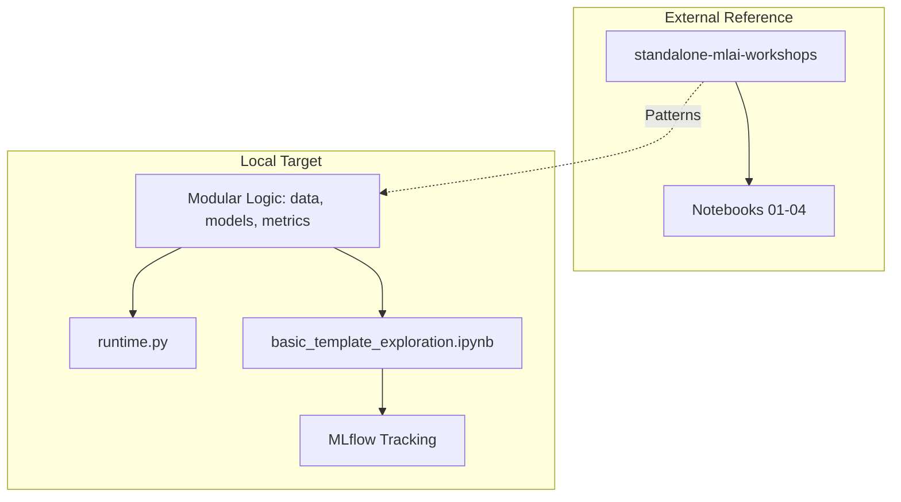

# Session Context Registry

## Current Session: Template Enhancement & MLAI Workshop Reference

### 🗺️ Context Map
This diagram shows the integration of MLAI workshop patterns into the Research Template.

### 📋 Context Bundle Log

| Task Slug | Context Bundle | Rationale |
| --- | --- | --- |
| `template-enhancement` | `data.py`, `models.py`, `metrics.py`, `basic_template_exploration.ipynb` | Integrating scientific best practices from MLAI workshops. |

### 🛠️ Verification Trace
- [x] MLAI Workshops Cloned Standalone
- [x] Modules 01-04 executed & summarized
- [x] Reproducibility helper added (`_to_rng`)
- [x] Modular logic files created
- [x] Onboarding notebook created (Colab + MLflow)
- [x] All changes committed

## 📊 Resource Management

| Metric | Current Value | Threshold | Status |
| --- | --- | --- | --- |
| Context Window Usage | ~8% (Estimated) | 60% | ✅ Healthy |
| Estimated Total Tokens | ~12,400 (Input: 11k, Output: 1.4k) | N/A | ✅ Optimized |
| Active File Context | 4 files (~450 lines) | < 10 files | ✅ Bounded |
| Implementation Diffs | ~45 lines | < 200 lines | ✅ Bounded |

> **Context Composition**: The active context includes the target source files (`analyze.py`, `report.py`), verification logic (`test_analyze_report.py`), and configuration (`analyze.yaml`). This lean context minimizes "noise" and ensures high-fidelity reasoning for the Temperature-Band feature.
